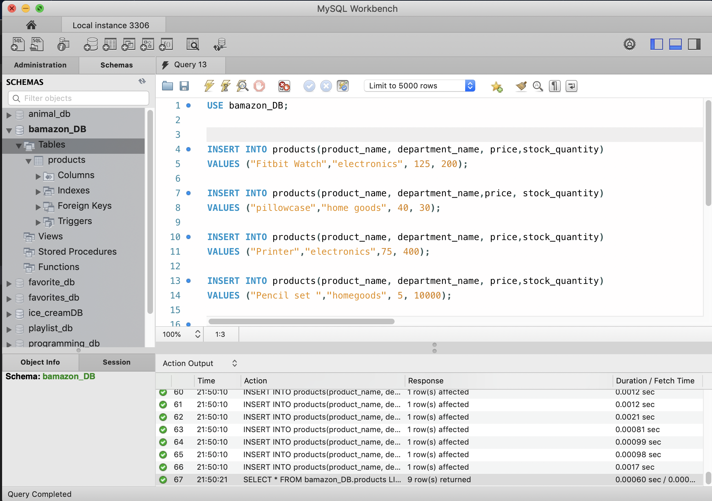
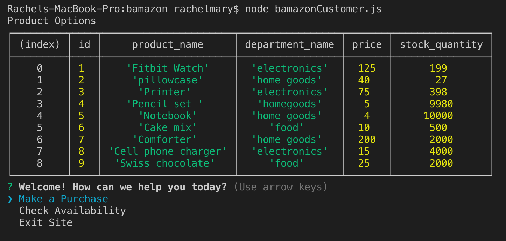
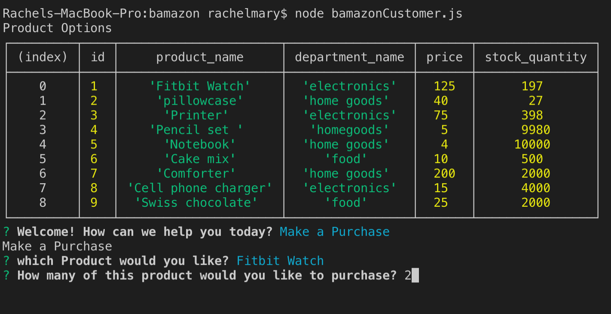
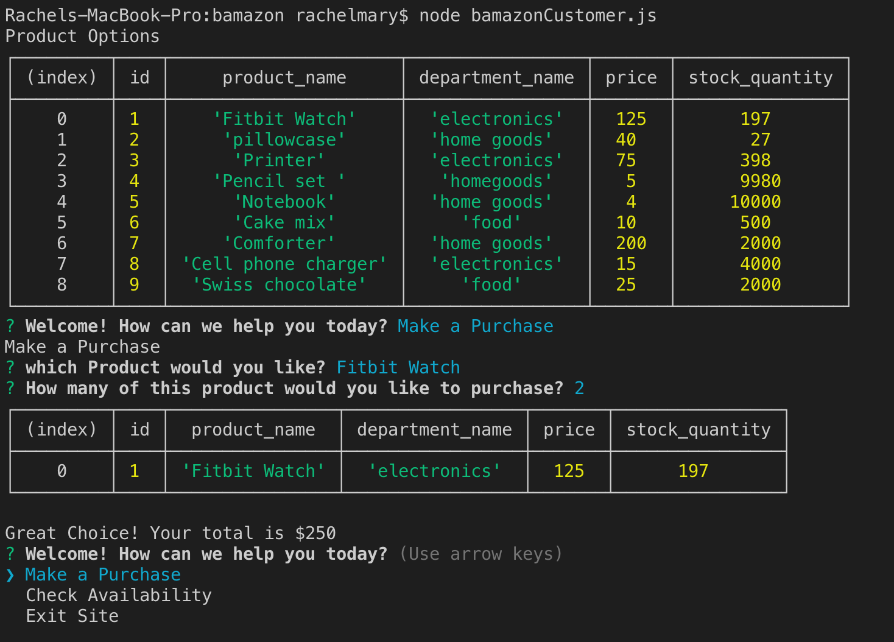
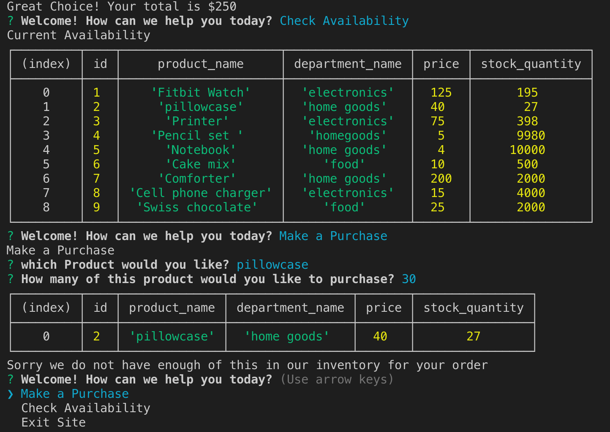

# Welcome to Bamazon

Overview:
Bamazon is a userfriendly website designed to make online shopping convient, fast and fun! It may or may not seem similar to another popular online retailer. Bamazon was made using Node and MYSQL

# Technologies Used:
 * MYSQL
* Programming Language:
    * Javascript
    * Node 

* NPM Depndencies within Node
    * .gitignore
    * inquirer

# How to get started:

* 1)First clone or download this repo using the software of your choice and install the packages required to run this application. 
        * NPM install 
* 2)Next using the MYSQL application, copy and paste the information from the schema and seeds into MYSQL workbench to create the bamazon database 

# How to Use
* 1)open the terminal in the BamazonCustomer.js file 
* 2)type "node BamazonCustomer.js" into the terminal
* 3)Then you will see a table with 3 options to either make a purchase, check availabilty or exit the site. Use the arrow key to make a selection

* 4)If you select to purchase the item, it will pull up the list of available products for you to chose from

* 5)After you select your product you enter the quantity you would like to purchase and then your price will be calculated

* 6)If you select an amount higher than the quantity available, then you will recieve the message bellow 

